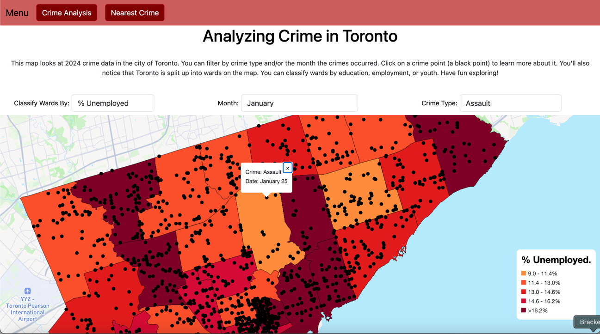
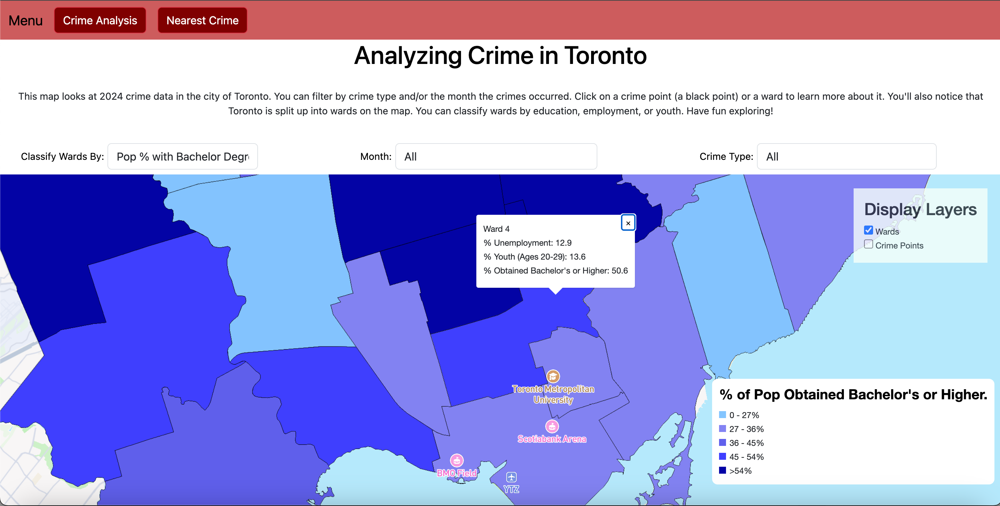
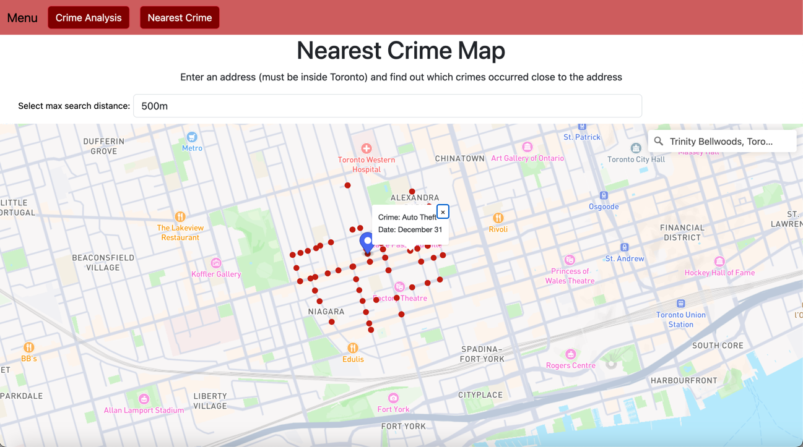

# Introduction

Welcome to **Analyzing Crime in Toronto**!

In this project there are two maps, the main map is called **Crime Analysis** and the
bonus map is called "**Nearest Crimes**".

In the main map, Crime Analysis, the user explores crimes that have occurred in Toronto during the year 2024 and if there are any
noticeable trends in the crimes. For example, the user may ask themselves, "do more assaults seem to occur in regions with a higher unemployment rate?". 
The user can explore the map and learn more about this topic, potentially generating new insights.

Meanwhile, in the Nearest Crimes Map, the user can search for an address within Toronto 
and see all the crimes that occurred within a specified distance of that address.

---
# Libraries

This project has utilized the following libraries:

- Turf (GIS Analysis)
- Bootstrap (Website Layout)
- Mapbox API (Map Rendering)
- Mapbox Geocoder API (Geocoding / Address Searching)

---

# Datasets

There are two datasets used for this project:

```CityWardsData.geojson``` - Data about the 25 wards located throughout Toronto

```crimes_2024.geojson``` - All recorded crimes in 2024 in Toronto. 2024 was chosen
since it is the latest year with all months updated.

All data is sourced from Toronto Open Data Portal.

Link: https://open.toronto.ca/

---

# Files

Here are important files and their main purposes:

```main.js``` - Handles the logic for the Crime Analysis map

```nearest_crime.js``` - Handles the logic for the Nearest Crime map (incorporating Turf which is new at this point in GGR472)

```style.css``` - All positioning and styling for this site is handled here

```index.html``` -  Handles webpage structure for Crime Analysis page

```nearest_crime.html``` - Handles webpage structure for Nearest Crime page

---

# How to Use

## Main Map: Crime Analysis

- Located on the map are numerous black points. Clicking on a point displays
information regarding the type and date of the crime that occurred there. Clicking on  a ward
shows you the ward number and some information about the ward.


- This project supports filtering crime by month of occurrence and/or type of crime. Just change the month or type in the dropdown
selection menu above the map and the map will update with data that meets the filter criteria. Here are some examples:
  - Setting month to ```January``` and type to ```Assault``` will result in the map displaying only crimes that are assaults and occurred in January.
  - Setting month to ```January``` and type to ```All``` will result in the map displaying all types of crimes that occurred in January.
  - Setting month to ```All``` and type to ```Assault``` will result in the map displaying crimes that are assaults in all months.
  - Setting both month and type to ```All``` will result in the map displaying all crimes.
- Disclaimer: Some filters may result in no crimes being displayed on the map. Do not fret! This simply means there is no data that matches the current filters.


- The wards can also be classified by different metrics. They can be classified by % of ward population considered youth (ages 20-29), % of ward population
who have obtained a bachelor's degree or higher, and % of ward population that is unemployed.
- 

- Finally, you can toggle the ward and crime layers on or off at any time by checking the layers on or off in the Display Layers menu.




## Bonus Map: Nearest Crimes

- When first rendering this map, it is empty! Do not fret, this is intended! The map requires a user input to render data!

- First, select a search distance. The default search distance is set at ```200m```. Then, using the search bar, select an address within the city of Toronto.
- Voila! The map will show all crimes that occurred within the searched distance of the specified address! Try changing the search distance for a particular address
to see how the results change! For example, try to input the address of ```Trinity Bellwoods, Toronto, Ontario, Canada``` (what a lovely park!) and change the search distance,
you'll notice dramatic changes in the map output!


- Crimes render as red dots, and the user specified address renders as a blue pin. Like the main map, you can click on a crime dot to learn more about the crime. 



---
# Credits

Created By Shawn Kapcan